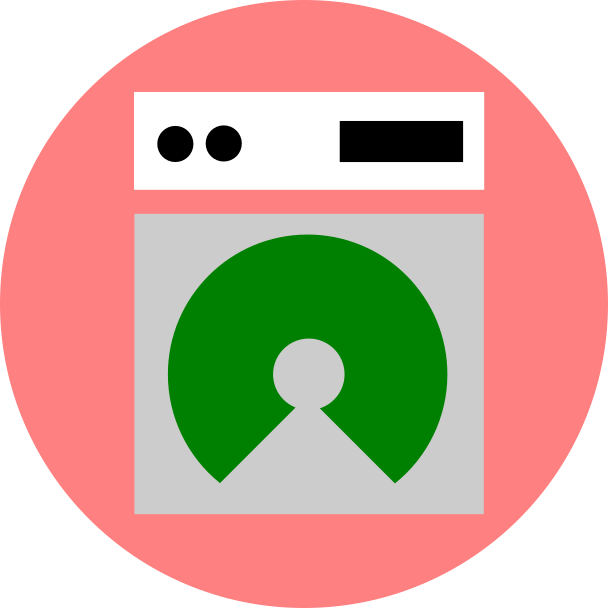

# openlaundry



Open source laundry PoS management system

### Features
- Works offline with cloud synchronization support (WIP) if needed
- Flutter codebase supports Android (binary release available) Web, and also iOS (codebase only)
- Client-heavy app

### Google sign-in
To integrate google sign-in on android, please replace the `android/app/google-services.json` file with your own Firebase project, and don't forget to fill the SHA-1 key.

```
keytool -list -v -keystore ~/.android/debug.keystore -alias androiddebugkey -storepass android -keypass android
```

If you have any inquiries or pull request approval to support the non-prioritised platforms (Web & iOS), feel free to open issues or contact me at valianmasdani@gmail.com
